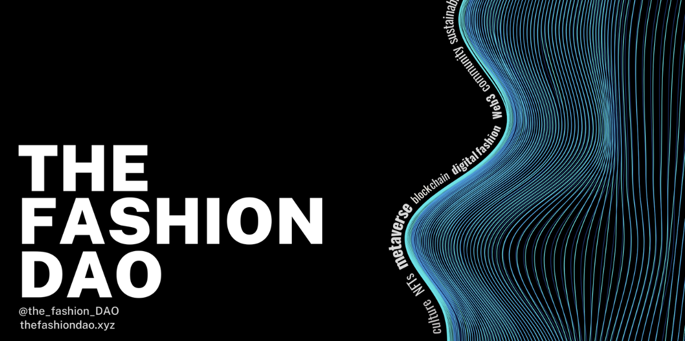

# Welcome to The Fashion DAO

<figure><figcaption></figcaption></figure>

The Fashion DAO is an autonomous and permissionless organization that provides various fashion related services for companies, teams and founders.

Our creative approach consists of project-based **interactive workshops**, **high fidelity prototyping** and **user testing.**

## Get started


****[**Check out our Quick Start Guide to get invovled right away ⟶**](welcome-to-the-fashion-dao/getting-started.md)****


[Join our Discord](https://discord.com/channels/971796278805663885/974063501800771636/1000137463433547857) and become part of our community. After you logged into our Discord, [apply as a Collaborator](https://www.thefashiondao.xyz/apply) to unlock internal channels and start working on client facing projects. During your application you will be asked a few basic questions about yourself and sign an agreement.&#x20;


****[**You can find all active projects and resources here ⟶**](https://bony-sponge-563.notion.site/Welcome-to-The-Fashion-DAO-6451dac1185747e5b8b060add2fae83e)****


## Any questions?

If you see things that are missing, wrong, or outdated, please help us make this document better for anyone working with The Fashion DAO. Email [contact@thefashiondao.xyz](mailto:contact@thefashiondao.xyz) and we'll update it right away!
